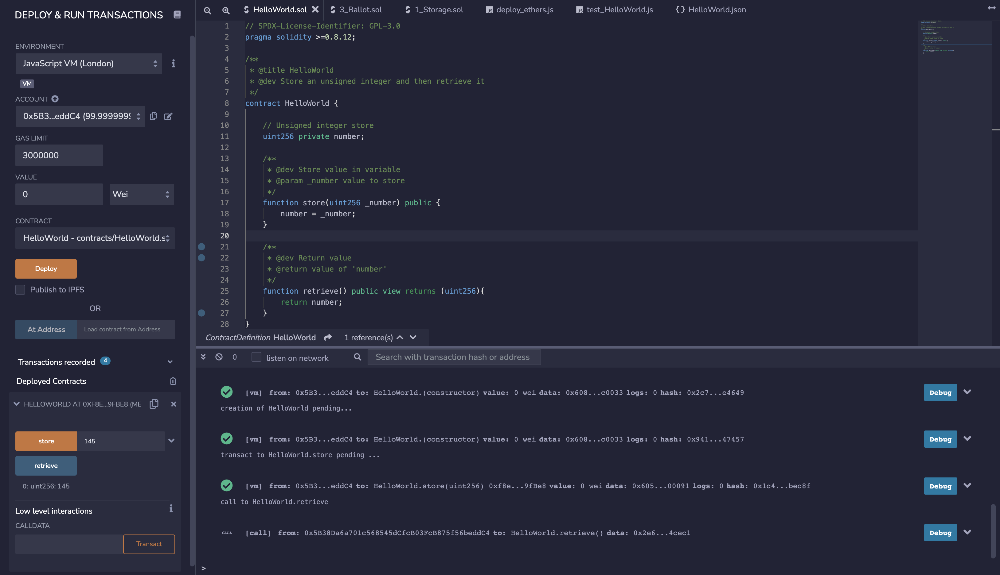

# Solidity

Q1.

```
// SPDX-License-Identifier: GPL-3.0
pragma solidity >=0.8.12;

/**
 * @title HelloWorld
 * @dev Store an unsigned integer and then retrieve it
 */
contract HelloWorld {

    // Unsigned integer store
    uint256 private number;

    /**
     * @dev Store value in variable
     * @param _number value to store
     */
    function store(uint256 _number) public {
        number = _number;
    }

    /**
     * @dev Return value
     * @return value of 'number'
     */
    function retrieve() public view returns (uint256){
        return number;
    }
}
```



Q2.

```
/**
 * Changelog: Takes list of voter address instead of single 
 * to support batching
 * @dev Only chairperson can call. Give a list of voters
 * the right to vote on this ballot.
 * @param voterAddresses Addresses of voters to send right
 */
function giveRightToVote(address[] memory voterAddresses) external {
    require(
        msg.sender == chairperson,
        "Only chairperson can give right to vote."
    );
    for (uint256 i = 0; i < voterAddresses.length; i++) {
        require(
            !voters[voterAddresses[i]].voted,
            "The voter already voted."
        );
        require(
            voters[voterAddresses[i]].weight == 0,
            "The voter already delegated"
        );

        voters[voterAddresses[i]].weight = 1;
    }
}
```

Q3. Deploy your script on Remix and compare the difference in gas fees between the original script and the improved script when giving 10 voters the right to vote. Once completed, submit (via pdf or Github) (1) your improved version of the contract (.sol file) with comments describing the changes you made, and (2) screenshots (before and after) of the gas fees for the transaction(s) to give 10 voters the right to vote. All code to be submitted either in pdf ( only code snippets where ever required) or via Github links ( copy the repo/pull-request links and the commit in the pdf).
