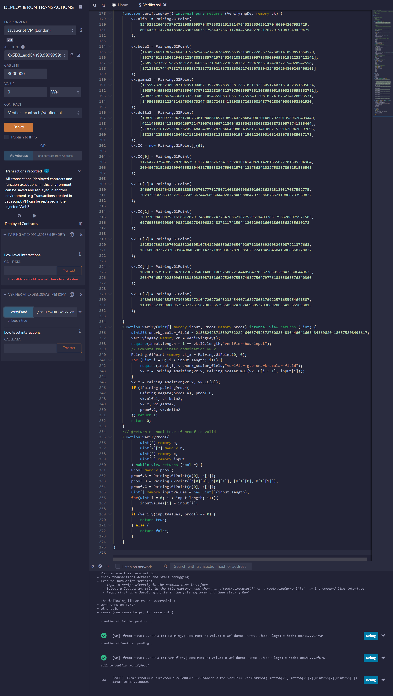
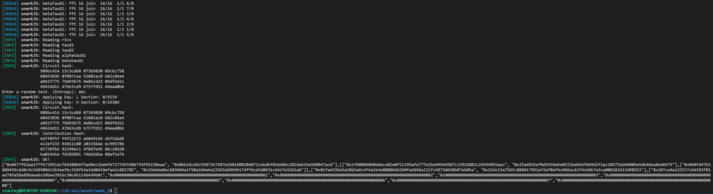

# ZKU.ONE Week1 Assignment

## Question 1 - Intro to circom
1. Takes a 4 leaves input and get the Merkle Root

    `get_merkle_root.circom`
    ```
    pragma circom 2.0.0;

    include "mimcsponge.circom";

    template GetMerkleRoot(nLeaves) {
        signal input leaves[nLeaves];
        signal output root;

        var nRuns = nLeaves / 2;

        component hashFunction;
        component hashFunctions[2];

        if (nRuns == 1) {
            hashFunction = MiMCSponge(2, 220, 1);
            hashFunction.k <== 0;
            hashFunction.ins[0] <== leaves[0];
            hashFunction.ins[1] <== leaves[1];
            root <== hashFunction.outs[0];
        } else {
            hashFunction = MiMCSponge(2, 220, 1);
            hashFunctions[0] = GetMerkleRoot(nRuns);
            hashFunctions[1] = GetMerkleRoot(nRuns);
            for (var i = 0; i < nRuns; i++) {
                hashFunctions[0].leaves[i] <== leaves[i];
                hashFunctions[1].leaves[i] <== leaves[nRuns + i];
            }
            hashFunction.k <== 0;
            hashFunction.ins[0] <== hashFunctions[0].root;
            hashFunction.ins[1] <== hashFunctions[1].root;
            root <== hashFunction.outs[0];
        }
    }

    component main {public [leaves]} = GetMerkleRoot(4);

    ```

    `public.json`
    ```
    [
        "6464294476958346139385024074008223400825166653076969388043746597957512245037",
        "1",
        "2",
        "3",
        "4"
    ]
    ```

    Verified with the deployed Verifier.sol on RemixIDE
    

2. When trying to scale up the input leaves to 8, I am getting `snarkJS: circuit too big for this power of tau ceremony. 9240*2 > 2**12`, thanks to my dear classmates on Discord and referring to snarkjs GitHub documentation again, it is because th number of constraints exceed the maximum that the ceremony can take (i.e 2^12 = 4096), I simply increase the maximum value from 12 to 16 and everything works fine as before.
    

    `public.json`
    ```
    [
        "7457672556014162487472065518158328090252704233415054189820328174772177160972",
        "1",
        "2",
        "3",
        "4",
        "5",
        "6",
        "7",
        "8"
    ]
    ```

3. Yes, it allows verifier to verify data in the Merkle Tree without knowing the actual input. Publicly verifiable smart contract cannot be used to construct the merkle tree as all the inputs will be public. Tornado Cash is using Merkle Tree technology, depositors use a random nullifier and their secret to compute a hash value stored in the Tornado Cash Merkle Tree, and when withdrawal they only have to provide that hash and nullifier for verification, no identity will be stored anywhere.

4. Thanks to the documentation of circom and snarkjs, each steps are well explained and I am able to put all steps to `execute.sh` for much faster and easier execution.

## Question 2 - Minting an NFT and committing the mint data to a Merkle Tree
## Question 3 - Understanding and generating ideas about ZK technologies
1. SNARKs comes out earlier than STARKs so there are better and more mature support from the community. As STARKs relies on hash function it requires a much larger proof size and hense cost more gas. But that also makes STARKs secure even after quantum computing available and STARKs does not need a Trusted setup.

2. Groth16 requires a per circuit trusted setup, meaning that any changes to the circuit requires a new trusted setup. On the other hand PLONK has a secure Multi Party Computation Ceremony, providing a universal trusted setup that can be independent to the circuit.

3. Inspired by the Merkle Tree technology, we can take unique token id of NFTs as input and "hash" a new NFTs from them, its like breeding but the output will be verifiable yet no need to its reveal parents.

4. I am thinking if ZK can improve the communication or chain of command in a DAO. Think of a DAO where members are all truly anonymous, they can use ZK to proof that they have the power to request others on some task, while the receiver of the request can verify the request is valid instead of some random outsider.