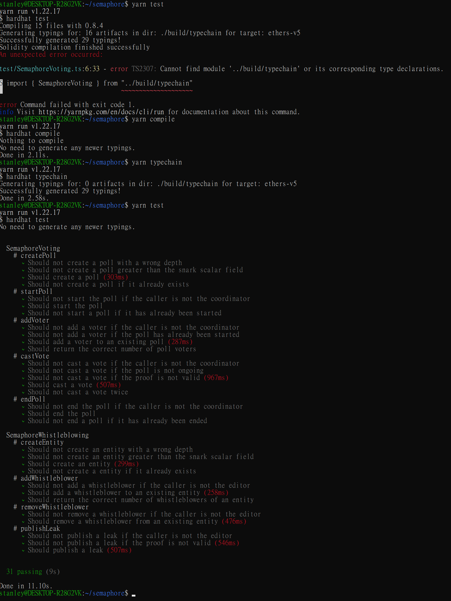
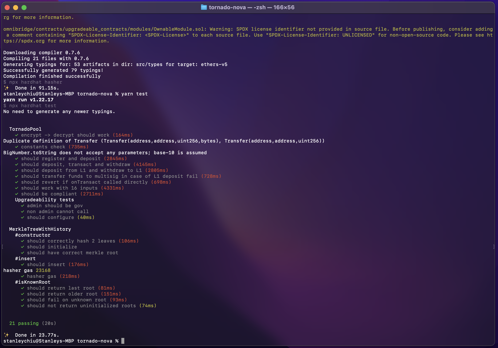

# ZKU - Assignment 2

    Email - stanleychiu@protonmail.com
    Discord - HKerStanley#4125
    GitHub - https://github.com/HKerStanley/zk-uni (./asset/week_2)

## Question 1

1. Frist transactions are broadcasted and processed and validated by miners, then packed into a new block. This new block will be verified by blockchain validators after they come to an agreement of the order of events and confirm that transactions in the block are valid, block will be added to the blockchain which leads the blockchain to a new state.

2. 1.
   2.
   3.

## Question 2

1.  By definition, Semaphore is a system which allows any Ethereum user to signal their endorsement of an arbitrary string, revealing only that they have been previously approved to do so, and not their specific identity.

    Users register their identity with hash of public key and random secrets, which stores in a Merkle Tree for later verification. When broadcasting signal, users will provide zero-knowledge proof of their membership and theres an public nullifier to check if the signal has been broadcasted before.

    Example of applications can be messaging application, digital document signing and POAP (Proof-Of-Attendance Protocol)

2.  1.  Screenshot of all test passed on main branch, commit `3bce72f` is failing `addWhistleblower` and `removeWhistleblower`
        

    2.  Commented version of `semaphore.circom` : <https://github.com/HKerStanley/zk-uni/blob/main/asset/week_2/semaphore_with_comment.circom>

    3.

3.  1. User can lost or expose their secret, just like how they lost or expose their wallet seedphrase or private key. Its is also possible for users to run out of gas, as register and login are all transactions on the blockchain.

    2. I think Elefria can support auto-download of the user secret which encrypted with user's private key, so that the secret key saving process can be automated and prevent human error.

## Question 3

1. For `tornado-trees` it is simply an Merkle Tree implementation, which I believe is how Tornado Cash used to verify if a deposit exist and if a withdrawal is valid. But for `tornado-nova` it also act as a mixer, which is an improvement of the prior version because a mixer support users to deposit and withdraw custom amount of fund.

2. 1. The previous Merkle root and the updated Merkle root are provided as public inputs, which the smart contract can alos validate with the value stored in its storage. Other supporting values will be provided as calldata, including the path to the

   2. I think it is because SHA256 hash support more and larger size of inputs, which on the orther hand Poseidon hash only support defined input fields, that makes SHA256 hash more suitable in the use case as it allows Tornado Cash takes more supporting values in to account during the update and verification process.

3. 1. Theres an error when I run with Windows WSL2 so I switch to use my Mac and all test passed.
      

4. L1Unwrapper is act as a bridge between L1 and the Gnosis Chain. When users withdraw assets from Tornado Cash Nova, the token will be unwrapped on L1 so that users can use them as they wish. The bridge will be able to collect transaction fee from the withdrawal(unwrap) process from user.

## Question 4

1. Tornado Cash's name is constantly brought up with criminal events like assets stealing or fraud, what is the team's stance for these kind of usage and how they put the balance between privacy and regulations?

2. It is hard to develop and maintain such one single circuit for all dapps, but there should be a set of circuits for a dapp domain. I am thinking this set of circuit like the programming language, that developers can leverage this set of well defined circuits to develop dapps. I believe in the future we will have many different set of circuits for zk-dapp development, just like today we have so many different programming language for different purpose.
