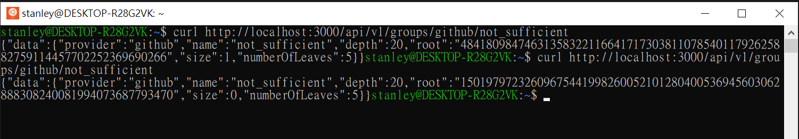

# ZKU - Assignment 3

    Email - stanleychiu@protonmail.com
    Discord - HKerStanley#4125
    GitHub - https://github.com/HKerStanley/zk-uni (./asset/week_3)

## Question 1: Dark Forest

1. Completed curcuit here: <https://github.com/HKerStanley/zk-uni/blob/main/asset/week_3/triangle_jump.circom>

## Question 2: Fairness in card games

1. User can salt the card with a random nullifier. So when they are commiting a card on-chain, they will need to hash the card number in {0..51} with a random nullifier they saved locally. Attackers will not be able to brute force the hash without getting the random nullifier.

2. From a deck of 52 cards with the integer representation in range {0..51}, we can further gives a suite representation in range {0..3} and their order A-K represented in range {0..13}. Expanding from part 1 answer, we will build a Merkle Tree and commit the merkle root on-chain. It will be a 4 leaves Merkle Tree goes like [0] - Integer of card order, [1] - Card order nullifier, [2] - Integer of card suite and [3] - Card suite nullifier. For the second card, we can require the hash of the right hand side to be remain unchanged, and generate a new Merkle Root that can be commited on-chain as the second card.

3. Revealing a card in such system is basically revealing the nullifier. Since we designed a system in part 2 that separate the order and suite of the card, keeping the suite nullifer private can keep it secret. The smart chain can compute the Merkle Root with these provided information and make sure the card is the same as commited.

## Question 3: MACI and VDF

1. Since MACI still relies on a trusted setup and have a trusted coordinator, there are some degrees of centralisation. Privacy will be lost if the coordinator is compromised and putting voters in danger or chance to get bribed. One possible solution is to use system like Semaphore to hide voter identity. With Semaphore voters identity can be remain hidden in the whole process and the coordinator responsibility remained on anti-collusion.

2. We can take on-chain data like `block.difficulty` and `msg.sender` and apply hash function to get a hash value h, the h % 6 will gives a number in {0..5} that simulate a dice roll result.

   1. The issue is as these data are from the blockchainwhich is deterministic, attackers are able to somehow predict or even manipulate the random result.
   2. We can distribute the computation of the randomness to multiple parties with a commit-reveal protocol. So every participant commit their encrypted random result to a smart contract, and when the commit phrase finished participants can reveal their result and the smart contract can derive a final result from the given values.
   3. The multi party system is fairer as involving more parties in the calculation process can distribute the risk of randomness manipulation. It decentralized the process that participants will have fairer weight on computing the randomness, which also lower the risk of single point failure.
   4. Since the random result relies on the revealed result of participants and the reveal process is controlled by participants, there are collusion potential that participants can manipulate the result by not revealing their commitment. We can solve this reveal withholding manipulation by using the VDF. Participants will not be able to predict how their reveal is going to affect the final result as the process will be delayed. The delay causes participants not able to have all the necessary information as there can be new changes come in during the delay or changes they are aware of but not actually knowing what it is.
## Question 4: InterRep

1. Interep semaphore as a system to store and verify users' reputation without having a actual linkage between the reputation identity and user identity. Interep still needs a centralized server because they need to get access to users account in external groups like Twitter or Telegram. In order to calculate the reputation and put the user in the correct group, users need to expose their secret to the verifier so that these external data can be verified. Interep as a trusted coordinator with a centralized server can achieve the reputation generation process by againing access to users' secret and make sure it is genuine.

2. When joining a group the identity commitment will be stored in a Merkle Tree node, immediately affected the Merkle Root value. When leaving a group, that node will reset its hash to 0, leading the merkle root to change. In the `treeRootBatches` collection, the document that holding `roots` array will append the new Merkle Root hash value to commit this change of Merkle Tree state.

3. Screenshot: 

## Question 5: Thinking in ZK

1. What if the external group is compromised or exploited? How should a external group verify the quality of user reputation? For example one can buy a lot of Twitter interactions, followers and like in very low cost, which can somehow manipulate the group of a user falls in. Is it worth or safe to account off-chain activities to user reputation? 
